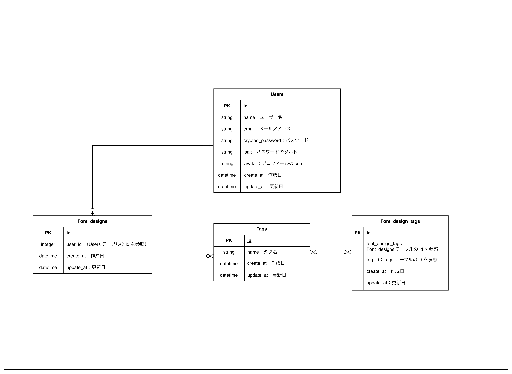

### ER図
（ER図のスクリーンショットを貼り付けてください）

### 本サービスの概要（700文字以内）
※ アプリの目的・概要・想定ユーザー・主な機能をまとめてください。
すでに完成されたフォントデザインを素材としてダウンロードできる機能。
想定ユーザーはSNS運用や、youtube制作・バナー作成やLP制作をされている方を想定しています。
・いつもと違うデザインも模索している方
・デザインに取り掛かるまでの素材選びに時間がかかってしまう方
・フリーデザインの線の太さや無妙なデザインの違いでまとまりがなく困っている方

年齢層は20代〜40代のSNS運用をされている方や広告担当をされている方です。

### MVPで実装する予定の機能

- 機能①ユーザー登録機能
- 機能②ログイン機能
- 機能③画像投稿・閲覧・削除機能
- 機能④画像ダウンロード機能
- 機能⑤タグ投稿・編集・削除

### テーブル詳細
#### usersテーブル
- name : string /ユーザー名
- email : string / ログイン用メールアドレス（ユニーク制約）
- crypted_password: string /暗号化パスワード
- salt：string /ランダムな文字列
- created_at：datetime /作成日
- updated_at：datetime /更新日

#### Font_designsテーブル
- user_id : integer/ Users テーブルの id を参照
- created_at：datetime /作成日
- updated_at：datetime /更新日

#### Tagsテーブル
- name : string/ タグ名
- created_at：datetime /作成日
- updated_at：datetime /更新日

#### Font_design_tags
- font_design_tags：integer/ タグ名
- tag_id：integer/ Tagsテーブルのid を参照
- created_at：datetime /作成日
- updated_at：datetime /更新日

Font_designs テーブルの id を参照
### ER図の注意点
- [ ] 最新のER図スクリーンショットがPRに掲載されているか
- [ ] テーブル名は複数形になっているか
- [ ] カラムの型は記載されているか
- [ ] 外部キーは適切か
- [ ] リレーションは正しく描かれているか
- [ ] 多対多の関係になっていないか
- [ ] STIを使用していないか
- [ ] postsテーブルに post_name のような命名をしていないか